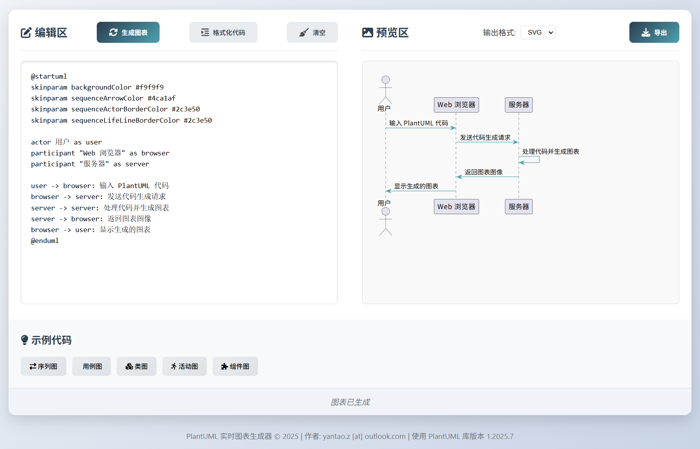

# PlantUML 实时图表生成器

## 功能简介

本工具提供基于 Web 的 PlantUML 实时图表生成服务，支持在线编辑 UML 代码并即时预览渲染结果。

## 环境要求

- Python 3.12 或更高版本
- Java 1.8 或更高版本

## 快速开始

1、克隆项目到本地：

```bash
git clone https://github.com/zhyantao/plantuml.git
```

2、运行启动脚本：

```bash
cd plantuml
./run.sh
```

3、在浏览器中访问 http://127.0.0.1:8000 即可使用。

## 使用示例



## 开源许可

本项目采用 [GPL-3.0 开源协议](https://github.com/zhyantao/plantuml?tab=GPL-3.0-1-ov-file)，请在使用和分发时遵守相关许可条款。
